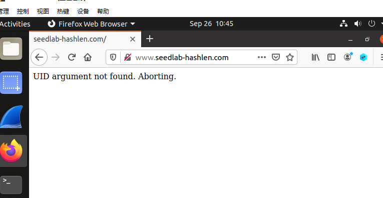

## 1. 实验目的

当客户端和服务器通过互联网通信时，它们会受到MITM攻击（即中间人攻击，Man-In-The-Middle Attack）。攻击者可以拦截来自客户端的请求，修改数据并发送修改后的请求给服务器。在这种情况下，服务器需要验证收到的请求的完整性。这个验证请求完整性的标准方法是向请求附加一个名为 MAC （即消息认证码，Message Authentication Code）的标签。

计算 MAC 的方法有很多，但是有些方法不安全。计算 MAC 的一种简单方法是将密钥和消息连接到一起，并计算合并后字符串的单向哈希值。这种方式会使得攻击者在不知道密钥的情况下，依然能够通过修改消息验证成功，也就是它会受到长度扩展攻击。

本次实验通过4个小任务达到以下两个目的。

1. 掌握 Hash 函数的计算原理和算法特点 

2. 了解 Hash 长度扩展攻击的工作原理


**推荐阅读**：关于单向哈希函数的一些详细介绍可以参考以下链接

- [Chapter 22 of the SEED Book, Computer & Internet Security: A Hands-on Approach, 2nd Edition, by Wenliang Du. See](https://www.handsonsecurity.net)

## 2. 实验内容

本次实验来自于https://seedsecuritylabs.org/Labs_20.04/Crypto/Crypto_Hash_Length_Ext/，共需要完成如下4个小任务。通过这4个任务完成对一个服务器网站的 Hash 扩展攻击，并对 Hash 扩展攻击进行防御验证。

1. 任务1：发送请求来列出所有文件

2. 任务2：创建Padding

3. 任务3：长度扩展攻击

4. 任务4：使用 HMAC 来抵御长度扩展攻击

## 3. 实验环境

本次实验基于预先创建的Ubuntu 20.04虚拟机，实验室的环境已经安装部署好。如果自行安装也可以从SEED的网站上下载（默认密码是dees）。

需要为此实验创建一个web服务器。客户端可以向此服务器发送命令列表，对于每个请求，必须附加基于密钥和命令列表计算得到的 MAC 。如果 MAC 验证成功，那么服务器将执行命令列表中的命令。使用虚拟机主机作为客户端，并且将web服务器置于容器中。

**创建容器和对应命令**：请下载[Labsetup.zip](https://seedsecuritylabs.org/Labs_20.04/Files/Crypto_Hash_Length_Ext/Labsetup.zip)到你的虚拟机中，解压缩并进入`Labsetup`文件夹，然后使用`docker-compose.yml`文件来创建实验环境。此文件和所有涉及到的Dockerfile中的内容的详细解释可以从[用户手册](https://github.com/seed-labs/seed-labs/blob/master/manuals/docker/SEEDManual-Container.md)中找到。如果这是你第一次使用容器创建SEED实验环境，阅读用户手册非常重要。

Docker和Compose一些常用的命令如下。这些命令在`.bashrc`文件中设置别名来方便使用（SEEDUbuntu 20.04虚拟机中设置了如下别名）

```
$ docker-compose build 		# Build the container image
$ docker-compose up 		# Start the container
$ docker-compose down 		# Shut down the container

// Aliases for the Compose commands above
$ dcbuild 			# Alias for: docker-compose build
$ dcup 				# Alias for: docker-compose up
$ dcdown 			# Alias for: docker-compose down
```

所有容器都将在后台运行。要在容器上运行命令，我们通常需要在那个容器上获得一个shell，为此首先需要使用`docker ps`命令来查找容器，然后使用`docker exec`在该容器上启动shell。我们已为这些命令在`.bashrc`文件中创建了别名来方便使用。

```
$ dockps 			// Alias for: docker ps --format "{{.ID}} {{.Names}}"
$ docksh <id> 		// Alias for: docker exec -it <id> /bin/bash

// 以下是一个获得hostC的shell的示例
$ dockps
b1004832e275 hostA-10.9.0.5
0af4ea7a3e2e hostB-10.9.0.6
9652715c8e0a hostC-10.9.0.7

$ docksh 96
root@9652715c8e0a:/#

// Note: If a docker command requires a container ID, you do not need to
// 		 type the entire ID string. Typing the first few characters will
// 		 be sufficient, as long as they are unique among all the containers.

```

**关于web服务器**：使用`www.seedlab-hashlen.com`作为域名。在虚拟机中，将此域名映射到web服务器所在容器（10.9.0.80）。这可以通过将以下目录添加到`/etc/hosts`文件中实现（如果虚拟机中没有该目录，请添加它）。

```
10.9.0.80 www.seedlab-hashlen.com
```

服务器代码位于`Labsetup/image_flask/app`文件夹中。它有两个目录，`www`目录包含服务器代码，`LabHome`目录包含一个`secret.txt`文件和用于计算$\text{MAC}$的密钥。

**发送请求**：web服务器程序接受以下命令：

- `lstcmd`命令：服务器会列出`LabHome`目录里的所有文件
- `download`命令：服务器会返回`LabHome`目录指定文件的内容

下面是一个客户端向服务器发送请求的典型示例。服务器需要`uid`参数来进行验证，它会使用`uid`来获得`LabHome/key.txt`下的密钥。以下示例中的命令是`lstcmd`，其值被设为1，它请求服务器列出所有文件。最后一个参数是基于密钥（由客户端和服务器共享）和命令列表参数计算得到的$\text{MAC}$。在执行命令之前，服务器将验证$\text{MAC}$以确保命令的完整性。

```
http://www.seedlab-hashlen.com/?myname=JohnDoe&uid=1001&lstcmd=1
&mac=dc8788905dbcbceffcdd5578887717c12691b3cf1dac6b2f2bcfabc14a6a7f11
```

应将`myname`字段中的值`JohnDoe`替换为你的实际姓名（不允许有空格）。此参数用于确保不同学生有不同的结果，因此大家的实验不能相互复制。服务器不使用此参数，但会检查该参数是否存在。如果不包括此字段，请求将被拒绝。我们将使用此参数检查是否学生自己完成了任务。

下面是另一个示例。请求包括两个命令：列出所有文件并下载文件`secret.txt`。类似地，需要有效的$\text{MAC}$，否则服务器将无法执行这些命令

```
http://www.seedlab-hashlen.com/?myname=JohnDoe&uid=1001&lstcmd=1
&download=secret.txt
&mac=dc8788905dbcbceffcdd5578887717c12691b3cf1dac6b2f2bcfabc14a6a7f11
```

## 4.自行搭建 SeedLab2.0 环境

使用VirtualBox-Windows版本，其下载地址https://download.virtualbox.org/virtualbox/6.1.38/VirtualBox-6.1.38-153438-Win.exe

使用SeedUbuntu20.04作为运行环境，其下载参考https://seedsecuritylabs.org/labsetup.html，由于下载较慢，推荐提前下载或者使用第三方镜像

打开Virtualbox，安装虚拟机

- 选择“新建”，对虚拟机进行命名，完成后点击“下一步”
- 设置内存大小，可以设置为4096MB（不改也可以），完成后点击“下一步”
- **使用已有的虚拟硬盘文件**，选择目录为下载好的`SEED-Ubuntu20.04.vdi`，完成后点击“创建”，完成虚拟机设置，启动即可
- 虚拟机默认密码是`dees`

为了便于使用，设置网络里端口转发，将子系统22端口转发到主系统2222端口，在VsCode中使用`ssh seed@127.0.0.1 -p 2222`即可连接虚拟机，便于编辑及传输文件。seedubuntu20.04本身就安装并启动了sshd服务，无需额外安装。

为了方便，我为本次实验创建了对应文件夹

```
[09/25/22]seed@VM:~$ mkdir Crypto_Hash_Extension
[09/25/22]seed@VM:~$ cd Crypto_Hash_Extension
[09/25/22]seed@VM:~/Crypto_Hash_Extension$ 
```

将下载的`Labsetup.zip`拖入该文件夹，并解压该压缩包

```
[09/25/22]seed@VM:~/Crypto_Hash_Extension$ unzip Labsetup.zip 
Archive:  Labsetup.zip
   creating: Labsetup/
  inflating: Labsetup/docker-compose.yml  
   creating: Labsetup/image_flask/
   creating: Labsetup/image_flask/app/
   creating: Labsetup/image_flask/app/LabHome/
  inflating: Labsetup/image_flask/app/LabHome/key.txt  
 extracting: Labsetup/image_flask/app/LabHome/secret.txt  
   creating: Labsetup/image_flask/app/www/
  inflating: Labsetup/image_flask/app/www/config.py  
  inflating: Labsetup/image_flask/app/www/lab.py  
   creating: Labsetup/image_flask/app/www/templates/
  inflating: Labsetup/image_flask/app/www/templates/index.html  
  inflating: Labsetup/image_flask/app/www/__init__.py  
  inflating: Labsetup/image_flask/bashrc  
  inflating: Labsetup/image_flask/Dockerfile
```


因为下载失败的原因，我在这里设置了docker国内镜像源

```
[09/25/22]seed@VM:~/Crypto_Hash_Extension$ sudo vi /etc/docker/daemon.json
```

写入如下内容，保存后退出

```
{
        "registry-mirrors": [
                "https://hub-mirror.c.163.com",
                "https://mirror.baidubce.com",
                "https://docker.mirrors.sjtug.sjtu.edu.cn"
        ]       
} 
```

 执行以下命令

```
[09/25/22]seed@VM:~/Crypto_Hash_Extension$ sudo systemctl daemon-reload
[09/25/22]seed@VM:~/Crypto_Hash_Extension$ sudo systemctl restart docker
```

之后创建容器

```
[09/25/22]seed@VM:~/Crypto_Hash_Extension$ cd Labsetup/
[09/25/22]seed@VM:~/.../Labsetup$ dcbuild
Building web-server
Step 1/4 : FROM handsonsecurity/seed-server:flask
flask: Pulling from handsonsecurity/seed-server
da7391352a9b: Pull complete
14428a6d4bcd: Pull complete
2c2d948710f2: Pull complete
01ee2d1608cf: Pull complete
9f40388d7765: Pull complete
2828455a2ef1: Pull complete
Digest: sha256:75d0de8a7f6b7230f235cfec1105d050f22f053b592f97fdd809dbf4c8c69c6c
Status: Downloaded newer image for handsonsecurity/seed-server:flask
 ---> 384199adf332
Step 2/4 : COPY app  /app
 ---> 93d402023264
Step 3/4 : COPY bashrc /root/.bashrc
 ---> 9bc743d13f8f
Step 4/4 : CMD cd /app && FLASK_APP=/app/www flask run --host 0.0.0.0 --port 80 && tail -f /dev/null
 ---> Running in cce21708ff1b
Removing intermediate container cce21708ff1b
 ---> 5ea8a9e99385

Successfully built 5ea8a9e99385
Successfully tagged seed-image-flask-len-ext:latest
```

在`/etc/hosts`中绑定ip和域名，添加并保存

```
[09/25/22]seed@VM:~/Crypto_Hash_Extension$ sudo vi /etc/hosts
```


启动容器：

```
[09/25/22]seed@VM:~/.../Labsetup$ dcup
Creating network "net-10.9.0.0" with the default driver
Creating www-10.9.0.80 ... done
Attaching to www-10.9.0.80
www-10.9.0.80 |  * Serving Flask app "/app/www"
www-10.9.0.80 |  * Environment: production
www-10.9.0.80 |    WARNING: This is a development server. Do not use it in a production deployment.
www-10.9.0.80 |    Use a production WSGI server instead.
www-10.9.0.80 |  * Debug mode: off
www-10.9.0.80 |  * Running on http://0.0.0.0:80/ (Press CTRL+C to quit)

```

 将此终端挂着，打开另一个终端查看：

```
[09/25/22]seed@VM:~/Crypto_Hash_Extension$ dockps
dbcd21ad6e6a  www-10.9.0.80
```

在虚拟机中使用浏览器访问：



环境搭建完毕