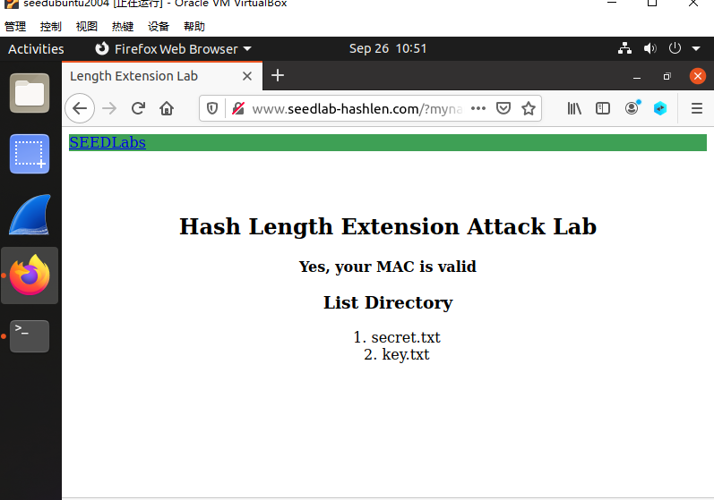

## 1 任务1：发送请求来列出所有文件

在这个文件中，我们将向服务器发送一个合法请求，以此来了解服务器是怎么响应我们发送的请求的。我们想要发送的请求如下：

```
http://www.seedlab-hashlen.com/?myname=<name>&uid=<need-to-fill>
&lstcmd=1&mac=<need-to-calculate>
```

发送一个请求，除了要有自己的名字参数`myname`外，我们还需要填充两个参数`uid`和`mac`。其中你需要在`LabHome`目录下的 `key.txt`中挑选一个uid，这个文件包含一个列表，有着冒号分隔的uid和密钥，可以使用任何一个uid及其对应密钥。例如，可以使用uid`1001`及它所对应的密钥`123456`。

缺少的第二个参数是$\text{MAC}$，该参数可以通过将密钥Key及请求R用冒号连接，然后进行计算得到，具体可以见下面的示例，uid`1001`所对应的key值是`123456`，请求的内容是`myname=JohnDoe&uid=1001&lstcmd=1`，连接后如下

```
Key:R = 123456:myname=JohnDoe&uid=1001&lstcmd=1
```

接着使用如下命令来计算$\text{MAC}$（命令是第一行，第二行是计算后的结果）：

```
$ echo -n "123456:myname=JohnDoe&uid=1001&lstcmd=1" | sha256sum
7d5f750f8b3203bd963d75217c980d139df5d0e50d19d6dfdb8a7de1f8520ce3 -
```

然后我们就能使用下面的完整请求，需要使用浏览器来将其发送到服务器程序：

```
http://www.seedlab-hashlen.com/?myname=JohnDoe&uid=1001&lstcmd=1
&mac=7d5f750f8b3203bd963d75217c980d139df5d0e50d19d6dfdb8a7de1f8520ce3
```

下图是修改myname = SEEDManual 对应访问网站的结果如下图所示，可见能够成功访问，并且列出了目录下的文件



**任务1**：请发送一个`download`命令到服务区，myname的信息修改为你自己的姓名拼音，并且记录你得到的响应内容

## 2 任务2：创建Padding

为了进行Hash长度扩展攻击，我们需要了解单向哈希函数的padding是如何计算的（padding就是填充）。SHA256的块大小是64字节，因此消息$\text{M}$在计算过程中将被填充为64字节的整数倍。按照$\text{RFC\;6234}$，SHA256的padding包括一个字节的$\text{0x80}$，接着是许多的$\text{0}$，最后是一个64bit（即8字节）的长度字段，长度字段中记录了消息$\text{M}$的bit数。

假设原始消息为$\text{M="This is a test message"}$，其长度为22字节，因此其padding填充为$64-22=42$字节，这42字节中包括8字节的长度字段，该长度字段的值为$\text{22*8=176=0xB0}$。因此SHA256将使用以下填充padding后的内容进行计算：

```
"This is a test message"
"\x80"
"\x00\x00\x00\x00\x00\x00\x00\x00\x00\x00"
"\x00\x00\x00\x00\x00\x00\x00\x00\x00\x00"
"\x00\x00\x00\x00\x00\x00\x00\x00\x00\x00"
"\x00\x00\x00"
"\x00\x00\x00\x00\x00\x00\x00\xB0"
```

需要注意的是，长度字段使用大端序，即如果消息的长度为$\text{0x012345}$，那么padding中的长度字段应为：

```
"\x00\x00\x00\x00\x00\x01\x23\x45"
```

**任务2**：你需要为以下消息创建对应padding，其中`<key>`和`<uid>`的实际内容应该从`LabHome/key.txt`文件中得到，myname依然用你自己的姓名：

```
<key>:myname=<name>&uid=<uid>&lstcmd=1
```

可以使用给出的compute_padding.py代码，大家打开代码看下具体内容,修改myname的值，了解padding的过程。然后执行下面的命令。
./compute_padding.py


应该注意，在URL中，所有padding中的十六进制数字都需要由`\x`改为`%`。例如，之前padding中的`\x80`需要改为`%80`，之后在服务器端，URL中的编码数据将对应更改为二进制数字。以下是示例：

```
"\x80\x00\x00\x99" should be encoded as "%80%00%00%99"
```

## 3 任务3：长度扩展攻击

在此任务中，我们将在不知道$\text{MAC}$密钥的情况下，为URL生成有效的$\text{MAC}$。假设我们知道有效请求$\text{R}$的$\text{MAC}$，还知道$\text{MAC}$密钥的大小，然后我们的工作是基于请求$\text{R}$构造一个新的请求，同时依然能计算得到新请求的有效$\text{MAC}$。

给定原始消息$\text{M="This is a test message"}$及其$\text{MAC}$值，我们将在下面展示如何添加一段消息$\text{Extra message}$到填充后消息$\text{M}$的尾部，然后计算其$\text{MAC}$而不需要知道$\text{MAC}$密钥。

```
$ echo -n "This is a test message" | sha256sum
6f3438001129a90c5b1637928bf38bf26e39e57c6e9511005682048bedbef906
```

下面的程序将用来计算新消息的$\text{MAC}$：

```
/* length_ext.c */
#include <stdio.h>
#include <arpa/inet.h>
#include <openssl/sha.h>
int main(int argc, const char *argv[])
{
    int i;
    unsigned char buffer[SHA256_DIGEST_LENGTH];
    SHA256_CTX c;
    
    SHA256_Init(&c);
    for(i=0; i<64; i++)
    	SHA256_Update(&c, "*", 1);
    
    // MAC of the original message M (padded)
    c.h[0] = htole32(0x6f343800);
    c.h[1] = htole32(0x1129a90c);
    c.h[2] = htole32(0x5b163792);
    c.h[3] = htole32(0x8bf38bf2);
    c.h[4] = htole32(0x6e39e57c);
    c.h[5] = htole32(0x6e951100);
    c.h[6] = htole32(0x5682048b);
    c.h[7] = htole32(0xedbef906);
    
    // Append additional message
    SHA256_Update(&c, "Extra message", 13);
    SHA256_Final(buffer, &c);
    
    for(i = 0; i < 32; i++) {
    	printf("%02x", buffer[i]);
    }
	printf("\n");
	return 0;
}
```

可以使用如下命令编译该程序：

```
$ gcc length_ext.c -o length_ext -lcrypto
```

**任务3.1**：你首先需要为下面的请求生成一个有效的$\text{MAC}$，其中`<key>`和`<uid>`的实际内容应该从`LabHome/key.txt`文件中得到：

```
http://www.seedlab-hashlen.com/?myname=<name>&uid=<uid>
&lstcmd=1&mac=<mac>
```

基于以上计算得到的`<mac>`值，构造一个新的包含`download`命令的请求，构造的构成中不允许使用密钥，新的URL请求结构如下：

```
http://www.seedlab-hashlen.com/?myname=<name>&uid=<uid>
&lstcmd=1<padding>&download=secret.txt&mac=<new-mac>
```
new-mac的生成，可以采用下面的方式，参考给出的代码，将里面初始值的信息换成填充前已经获取到的mac值的信息，如何分割成8个8位的信息，可以自己写代码也可手工完成。
    $ gcc url_length_extension.c -lcrypto
    $ a.out

然后发送构造好的新请求到服务器，记录你收到的服务器响应，即你需要证明你得到了`secret.txt`文件的内容，以此来说明你完成了本次攻击。

**任务3.2**：发送构造好的新请求到服务器，记录收到的服务器响应并截图。

## 4 任务4：使用HMAC来缓解长度扩展攻击

到目前为止的实验内容中，我们已经了解到，通过连接密钥和消息然后进行计算得到$\text{MAC}$的方法是不安全的。在这个任务中，我们将修复这种错误，计算$\text{MAC}$的标准方法是使用$\text{HMAC}$。你应该修改服务器程序的`verify-mac()`函数，并使用Python的`hamc`模块包来计算$\text{MAC}$。其中`verify-mac()`函数在`lab.py`文件中。给定一个密钥和消息（都是字符串类型），可以如下计算$\text{HMAC}$值。

```
real_mac = hmac.new(bytearray(key.encode(’utf-8’)),
			msg=message.encode(’utf-8’, ’surrogateescape’),
			digestmod=hashlib.sha256).hexdigest()
```

完成以上更改后，停止所有容器，并重新build它们，然后再次启动所有容器。只有这样，你所作的改变才会生效。之后，你应该重复任务1，需要注意的是，此次使用$\text{HMAC}$来进行$\text{MAC}$的计算。假设所使用的$\text{MAC}$密钥为`123456`，$\text{HMAC}$能够通过如下代码进行计算：

```
#!/bin/env python3

import hmac
import hashlib
key=’123456’
message=’lstcmd=1’
mac = hmac.new(bytearray(key.encode(’utf-8’)),
				msg=message.encode(’utf-8’, ’surrogateescape’),
				digestmod=hashlib.sha256).hexdigest()
print(mac)
```

**任务4** 按照预期，当服务器和客户端都使用$\text{HMAC}$来计算$\text{MAC}$时，发送长度扩展（添加了额外命令）的恶意请求将会失败，你需要记录下来并分析其中的原因

## 提交

你需要提交一份具体的实验报告包含以上的几个任务，其中应包含实验截图，并描述你做了什么，及你观察到了那些内容.

